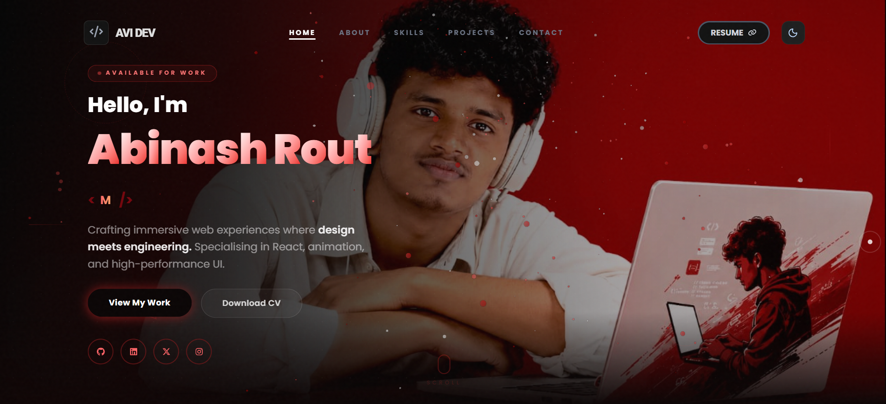

# Personal Portfolio Website

A modern, fully responsive portfolio application built with cutting-edge web technologies. This professional portfolio showcases technical skills, project work, and professional experience through an interactive and performant web interface.



## Overview

This portfolio website demonstrates expertise in front-end development with a focus on responsive design, performance optimization, and modern user experience principles. Features include smooth animations, theme switching capabilities, and comprehensive project documentation.

## Key Features

- **Responsive Design** — Fully optimized for desktop, tablet, and mobile devices
- **Theme Support** — Dark and light mode toggle with persistent user preferences
- **Interactive Animations** — Smooth transitions and engaging visual effects throughout
- **Project Showcase** — Detailed project cards with filtering and modal views
- **Contact Integration** — Functional contact form with email delivery
- **Performance Optimized** — Fast load times and smooth scrolling experience
- **Custom UI Elements** — Particle backgrounds and interactive cursor effects
- **Accessibility** — Semantic HTML and keyboard navigation support

## Technology Stack

| Component                 | Technology                          |
| ------------------------- | ----------------------------------- |
| **Frontend Framework**    | React 18+ with Vite                 |
| **Styling & Layout**      | Tailwind CSS                        |
| **Animations**            | Framer Motion, GSAP, CSS Animations |
| **State Management**      | React Context API                   |
| **UI Components & Icons** | Lucide React, React Icons           |
| **3D Effects**            | React Parallax Tilt                 |
| **Email Service**         | Email.js                            |
| **Development Tools**     | ESLint, Vite                        |
| **Deployment**            | Vercel                              |

## Project Architecture

```
My-Portfolio/
├── public/                      # Static assets
├── src/
│   ├── components/              # React components
│   │   ├── About.jsx           # About section
│   │   ├── Banner.jsx          # Hero banner
│   │   ├── Contact.jsx         # Contact form
│   │   ├── CustomCursor.jsx    # Custom cursor effect
│   │   ├── Footer.jsx          # Footer section
│   │   ├── Header.jsx          # Navigation header
│   │   ├── Home.jsx            # Home page wrapper
│   │   ├── Loader.jsx          # Loading animation
│   │   ├── Particles.jsx       # Particle background
│   │   ├── Project.jsx         # Projects showcase
│   │   ├── Skill.jsx           # Skills section
│   │   ├── TextType.jsx        # Typing animation
│   │   └── ThemeToggle.jsx     # Theme switcher
│   ├── context/
│   │   └── ThemeContext.jsx    # Global theme state
│   ├── utils/
│   │   └── Project.jsx         # Project data and utilities
│   ├── App.jsx                 # Root component
│   ├── index.css               # Global styles
│   └── main.jsx                # Application entry point
├── eslint.config.js            # ESLint configuration
├── package.json                # Project dependencies
├── tailwind.config.js          # Tailwind configuration
├── vite.config.js              # Vite configuration
└── README.md                   # Project documentation
```

## Getting Started

### Prerequisites

- Node.js 16.x or higher
- npm or yarn package manager

### Installation

1. Clone the repository:

   ```bash
   git clone https://github.com/Abinashrout244/My-Portfolio.git
   cd My-Portfolio
   ```

2. Install dependencies:

   ```bash
   npm install
   ```

3. Start the development server:

   ```bash
   npm run dev
   ```

4. Open your browser and navigate to `http://localhost:5173`

### Development Commands

- `npm run dev` — Start development server
- `npm run build` — Build for production
- `npm run lint` — Run ESLint code analysis

## Deployment

### Vercel Deployment

This project is optimized for deployment on Vercel with zero-config setup:

1. Push your code to a GitHub repository
2. Visit [vercel.com](https://vercel.com) and import your repository
3. Configure environment variables if needed
4. Deploy with a single click — automatic builds on every push

### Environment Variables

For email functionality, configure the following environment variables in your deployment platform:

- `VITE_EMAILJS_SERVICE_ID` — Email.js service ID
- `VITE_EMAILJS_TEMPLATE_ID` — Email.js template ID
- `VITE_EMAILJS_PUBLIC_KEY` — Email.js public API key

## Code Quality

This project uses ESLint to maintain consistent code quality and style standards. Run linting checks with:

```bash
npm run lint
```

## Performance Optimizations

- **Lazy Loading** — Components and images load on demand
- **Code Splitting** — Vite automatically optimizes bundle sizes
- **CSS Optimization** — Tailwind purges unused styles
- **Smooth Scrolling** — GSAP ScrollTrigger for efficient animations
- **Theme Caching** — Local theme preference storage

## Contributing

Contributions are welcome. To contribute:

1. Fork the repository
2. Create a feature branch (`git checkout -b feature/enhancement`)
3. Commit your changes (`git commit -m 'Add enhancement'`)
4. Push to the branch (`git push origin feature/enhancement`)
5. Open a Pull Request

Please ensure code follows project standards and all tests pass before submitting.

## Contact & Social

Connect with me across professional networks:

- **LinkedIn:** [Abinash Rout](https://www.linkedin.com/in/abinash-rout-274285322)
- **GitHub:** [Abinashrout244](https://github.com/Abinashrout244)
- **Email:** [abinashrout.mail@gmail.com](mailto:abinashrout.mail@gmail.com)

## License

This project is open source and available for personal and professional use.

---

**Developed by Abinash Rout**
